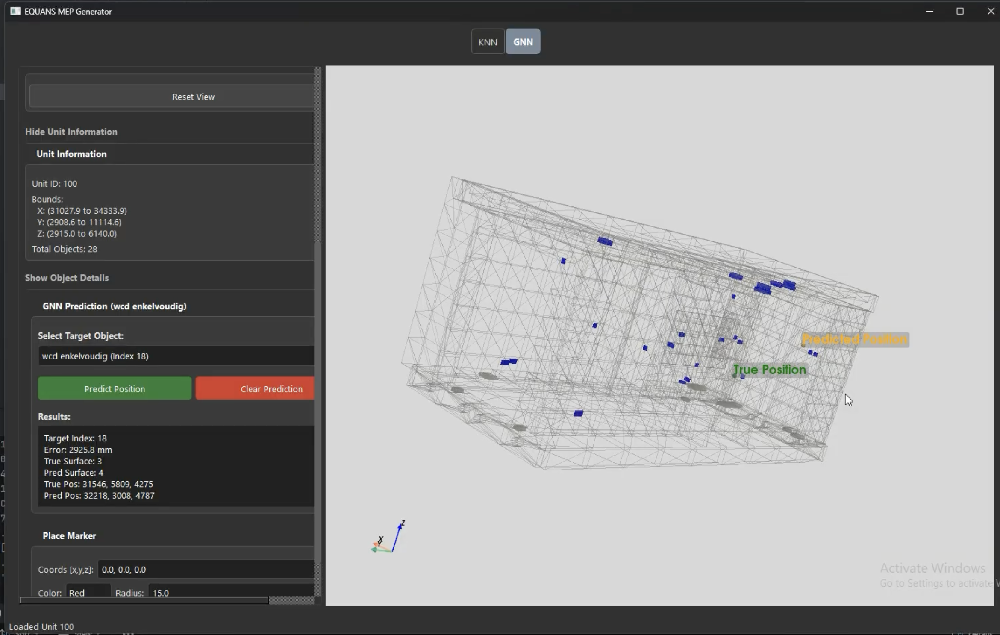

# EQUANS MEP Generator - Detailed Documentation

This directory contains the core logic and UI for the EQUANS MEP Generator, a tool designed for automated MEP (Mechanical, Electrical, and Plumbing) element placement using GNN (Graph Neural Networks) and KNN (K-Nearest Neighbors) models.


## Prerequisites

- **Python**: Recommended version 3.11.

## Installation

1. **Enter the repository**:
   cd EquansFinalProduct
   cd main

2. **Install dependencies**:
   source venv/bin/activate  # On Windows: venv\Scripts\activate
   pip install -r requirements.txt


## Running the UI

The main entry point for the application is `main/UI/main_UI.py`.

To launch the interface:
```bash
python main/UI/main_UI.py
```

### UI Features

The application features a dark-themed interface with two primary modes:

- **GNN (Graph Neural Network)**: 
  - Used for mep predictions, read more about it in GNN_Doc.md
  - Supports loading models and visualizing predicted placements directly on the scan.
 
 exmaple of 
- **KNN (K-Nearest Neighbors)**:
  - Used for copy-paste rooms
  - Great execution for simpler geometric layouts, especially lamp positions
   
   example of it being in use

## Directory Structure

- `main/UI/`: Contains the main application window and sub-widgets.
- `main/UI/viewer/`: Contains specialized 3D viewers for GNN and KNN results.
- `main/Model/`: (Optional) Directory for pre-trained weights or model definitions.
- `main/Data/`: Project-specific data assets.

