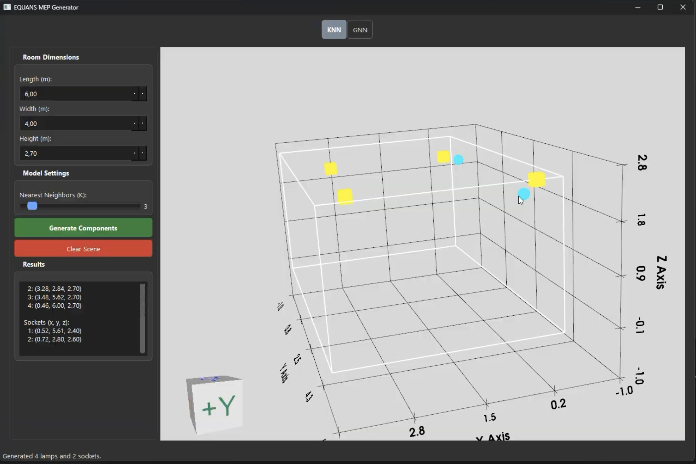

# EQUANS MEP Generator - Documentation

Integrated solution for automated MEP (Mechanical, Electrical, and Plumbing) element placement using GNN (Graph Neural Networks) and KNN (K-Nearest Neighbors) models.

To provide a more informative doc, we recorded a video with the instructions on how to run the code which can be found at: [Video Manual](https://drive.google.com/file/d/1lTpRcX36tt_ml88G29SjjS0nSMNak3_f/view?usp=sharing)

## Prerequisites

- **Python**: Recommended version 3.11.
- **Hardware**: For GNN-based placement on large 3D scans, a GPU with CUDA/MPS support is recommended (CPU fallback is available).

## Installation

1. **Enter the repository**:
   ```bash
   cd EquansFinalProduct
   cd main
   ```

2. **Install dependencies**:
   It is highly recommended to use a virtual environment:
   ```bash
   python -m venv venv
   source venv/bin/activate  # On Windows: venv\Scripts\activate
   pip install -r requirements.txt
   ```

## Running the UI

The main entry point for the application is `main/UI/main_UI.py`.

To launch the interface from the `main` directory:
```bash
python UI/main_UI.py
```

### UI Features

The application features a dark-themed interface with two primary modes:

#### GNN (Graph Neural Network)
- Used for intelligent MEP predictions on 3D point cloud scans.
- Supports loading models and visualizing predicted placements directly on the scan.

*Example of GNN prediction in use*

#### KNN (K-Nearest Neighbors)
- Used for fast placement based on manual room definitions and historical data.
- Great for simpler geometric layouts, especially lamp positions.

*Example of KNN placement in use*

---

## Technical Deep Dive: GNN Pipeline

This section explains the purpose and usage of the key Python scripts for the Graph Neural Network (GNN) model.

### 1. `preprocess.py`
**Purpose**: Converts raw architectural data into graph datasets. It identifies specific components (e.g., wall sockets) and converts each unit into specialized graph files (`.pt`), masking the target component for training.

**How to Run**:
```bash
python preprocess.py 
```
*Key Arguments:* `--data_dir`, `--index_json`, `--output_dir`, `--target_component` (Defaults are pre-configured).

### 2. `Model/train.py`
**Purpose**: Trains the GNN using preprocessed graph files. Supports standard Train/Validation and K-Fold Cross-Validation. Utilizes GPU (CUDA/MPS) if available.

**How to Run**:
```bash
# Standard training
python Model/train.py --split_json Data/DataTraining/wcd_enkelvoudig_split.json

# K-fold cross-validation
python Model/train.py --kfold_json Data/DataTraining/wcd_enkelvoudig_kfolds.json
```

### 3. `Model/evaluate.py`
**Purpose**: Evaluates a trained model on a single, unprocessed unit. It calculates confidence scores and displacement error in millimeters.

**How to Run**:
```bash
python Model/evaluate.py --unit_dir Data/DataNormalized/gebouwE/unit_0001
```

---

## Directory Structure

- `main/UI/`: Main application window and viewer components.
- `main/Model/`: GNN architecture, training scripts, and checkpoints.
- `main/Data/`: Project-specific data assets and training splits.
- `app/`: KNN-specific implementation and standalone logic.

## KNN Standalone
The working versions of the KNN models can also be found in the `app/` directory, where a separate UI can run only the KNN models (note that the main UI in `main/UI/` integrates both).
